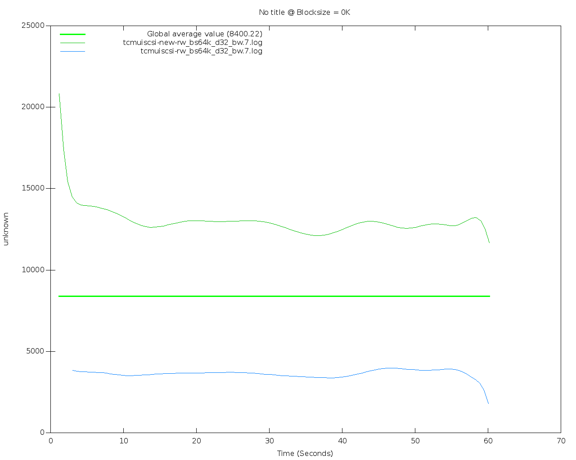
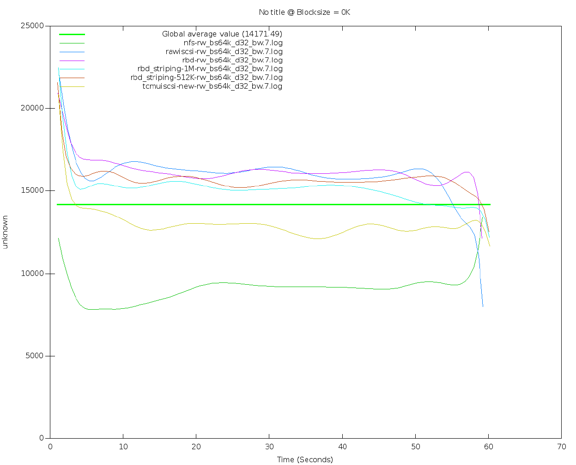

************
Ceph + iscsi
************

Ceph-iscsi
==========

Первый и основной способ это использование ceph-iscsi. Продукт этот на данный момент зрелый, поддерживается компанией
redhat и, с недавних пор, suse.

Пакеты можно взять на `официальном репозитории <https://download.ceph.com/ceph-iscsi/>`_.
Установка тривиальна и хорошо описана в `официальной документации ceph <http://docs.ceph.com/docs/mimic/rbd/iscsi-overview/>`_,
так и в документации `Red Hat Ceph Storage 3+ <https://access.redhat.com/documentation/en-us/red_hat_ceph_storage/3/html/block_device_guide/using_an_iscsi_gateway>`_.
В документации так же описано как настраивать инициаторы, и этих правил следует придерживаться,
т.к. у текущей реализации `есть свои ограничения <https://access.redhat.com/documentation/en-us/red_hat_ceph_storage/3.0/pdf/release_notes/Red_Hat_Ceph_Storage-3.0-Release_Notes-en-US.pdf>`_.

Из приятных бонусов этого решения:

* Централизованое управление через утилиту gwcli
* Простой деплой самого приложения
* Интегрированность в ceph (в частности в выводе `ceph -s` можно увидеть `tcmu-runner: 3 daemons active` )
* Поддержка `SCSI-3 PR <http://www.gonzoleeman.net/scsi-3-pgr-tutorial-v1.0>`_, которая может понадобится,
  например, для серверов на базе ОС Windows для кворумных дисков или общих ресурсов для БД или кластеризиции.
* Отказоустойчивость из коробки, т.к. вы анонсируете портальную группу, и ваш клиент может переключиться
  по failover на другой портал.

Минусы этого решения:

* Не будет бонусов в виде отказоустойчивости, если инициатор не умеет с этим работать
* В основе продукта лежит tcmu-runner, который **значительно** медленнее работает чем вариант
  "замаппить rbd и отдать его как диск", т.к. последний вариант близок по скорости к варианту отдать rbd нативно через librbd,
  в то время, как вариант с tcmu-runner'ом медленнее в ~2 раза

Особенности этого решения:

Приведу здесь несколько графиков, снятых с помощью fio на кластере среднего пошиба из ВМ.
Диски подключались к ВМ нативно через qemu, через iscsi (в двух вариациях), через nfs

Профиль
ioengine=libaio
direct=1
buffered=0
time_based=1
size=20g
wait_for_previous
filename=/root/tests/bigfile
iodepth=32
rw=randwrite
bs=4m

* Разница между tcmu-runner версий 1.3.0 и версии 1.3.X с одним из последних патчей который повышает производительность,
  который бэкпортировали себе в продукт RHCEPH компания RedHat

|

* Разница между различными бэкендами

|

Из этих графиков видно что:

#. TCMU-runner значительно медленее варианта с raw iscsi

#. Работа по решению проблем со скоростью ведется, и стоит ожидать что в следующих версиях
   скорость будет выше

Raw rbd + iscsi
===============

Второй вариант заключается в том что нужно замаппить rbd на систему предполагаемого таргета
и анонсировать как блочное устройство.

Плюсы этого решения:

* Скорость близка к нативному rbd
* Нет надобности ставить дополнительное ПО

Минусы этого решения:

* Так как не все rbd features реализованы в модуле rbd в ядре (далее krbd), необходимо отключать все
  features rbd выше layering (далее выдержка из master ветки ядра)

::

  /* Feature bits */
  #define RBD_FEATURE_LAYERING          (1ULL<<0)
  #define RBD_FEATURE_STRIPINGV2        (1ULL<<1)
  #define RBD_FEATURE_EXCLUSIVE_LOCK    (1ULL<<2)
  #define RBD_FEATURE_DATA_POOL         (1ULL<<7)
  #define RBD_FEATURE_OPERATIONS        (1ULL<<8)

* Т.к. используется krbd, существует вполне реальная опасность, что некорректно работающий инициатор может `положить`
  не только iscsi, но и кластер ceph. У автора этой заметки были случаи когда windows initiator мешал модуль lio, а
  вместе с ним падал и ceph, т.к. появлялось много blocked requests, связанных с sub ops'ами.

* Если нужна отказоустойчивость, придётся делать её самому.

Плюсы этого решения:

* Относительная простота

* Скорость работы

При работе с krbd следует максимально обезопасить кластер, для этого нужно обновлять ПО на инициаторе (например кумулятивные
апдейты windows), и обновлять версию ядра на кластере с iscsi таргетами, т.к. модули LIO и RBD находятся в ядре,
более новые ядра ведут себя стабильнее даже когда начинаются проблемы с подсистемой iscsi (LIO), это уже не так пагубно влияет
на кластер ceph. Желательно использовать 4.14+.

У автора данной заметки windows initiator с определенным набором апдейтов с mtu 9000 на сетевом адаптере выводил из строя
кластер ceph, и при этом же с mtu 1500 такой проблемы не наблюдалось.

Если нужен SCSI-3 PR, то оптимальным вариантом будет сделать "плавающий"
таргет. Самый простой вариант сделать virtual ip (далее vip), настроить таргеты на прослушивание этого vip, и сделать
миграцию адреса через pacemaker, keepalived, etc.

В этом случае будет работать Persistant Reservation, т.к. PR эмулируется LIO локально на таргете.
Но все запросы будут приходить на один сервер

Если не требуется поддержка PR, то можно сделать несколько разных порталов с идентичными таргетами (c одинаковыми wwn), и настраивать
failover на инициаторах (например через multipath). В некоторых решениях, используется кластерный lvm (clvmd или lvmlockd).

Резюмируя вышесказанное
=======================

Выводы:

#. Самый простой отказоустойчивый спобоб использовать iscsi и ceph - использовать ceph-iscsi. Все остальные способы
   потребуют инженерной смекалки и осторожности.

#. Всегда предварительно нужно тестировать работу на конкретном оборудовании

#. Даже, казалось бы, такая мелочь, как MTU на стороне инициатора может вызвать отказ в обслуживании в нашем СХД

#. Очень желательно ставить обновления, на системы, что на Linux (обновление системы и ядра), что Windows, ставить
   последние прошивки и драйвера для сетевых устройств.

#. В ядро rhel постоянно бэкпортируют части кода из нового ядра, но в некоторых случаях новые ядра ведут себя стабильнее.
   А т.к. модули Lio и модуль rbd находятся в ядре, и в них регулярно вносят изменения, то это напрямую влияет на
   возможности и стабильность кластера. В официальной документации рекомендованы lts ядра версий 4.9 или 4.14. Если
   используется ceph-iscsi, то ядра 4.16+/ядра из rhel 7.5+, т.к. для его работы нужны специфичные патчи в ядро.

#. Если бы мы использовали tcmu-runner, который не использует krbd, а использует librbd, скорее всего проблемы с
   инициатором не затрагивали бы наш кластер ceph

